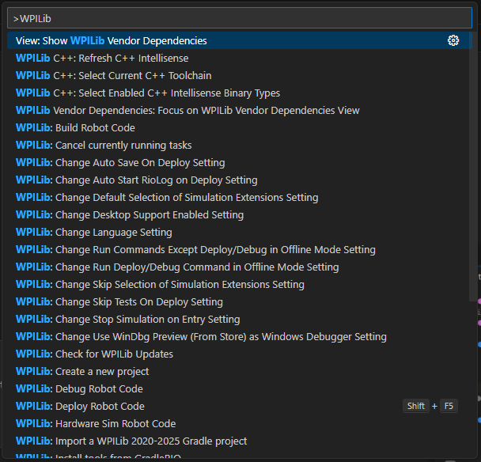
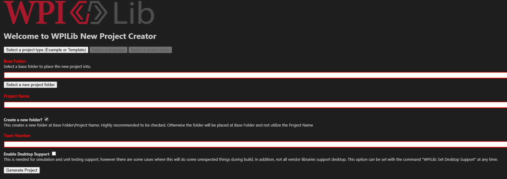

# Making a Project
Lets begin our journey of tank drive by Making a Project

:::note

It's completely fine to not know what tank drive is, this tutorial will be extremely in depth (to the point of uselessness) as it is the first in the series of beginner tutorials in the documentation.

this tutorial does assume you read the [Configuring your environment](/software/configuring-your-env) and [What is Software](/software)

:::

First step is to open WPILib VSCode (either called year WPILib VSCode, or just VSCode on macOS)

Then click the WPILib icon in the top right (should say "open WPILib Command Palette"). It should open a menu that looks like this:

Now we will type `>WPILib create a new project` (including the `>WPILib` that is automatically filled) and press enter.

After pressing enter you should get to a menu that looks like this:

First we will select our project type of `Template`, then for our language we will select `Java`. For our project base we will select `Command Robot`

The reasoning behind all of this is kind of confusing, but basically we are selecting from some premade java templates that will write out the basic starter code for us!

Next we will select our `Base Folder` you want to either make a new directory, or select a directory where other projects exist. 
This directory will become your 'FRC Projects' sorta directory, we want to use this one for all our FRC projects! 
:::note

of course you do not have to select a good directory, you can even just put the project on C:/, the above statement is just good practice!

:::

Next we need a project name, this can be anything, but for our project I will pick `TankBotTutorial`.

Let's also make sure `Create a new folder?` is checkmarked.
:::warning

if you do not check this box, then the project will be created in the directory you selected instead of making a new folder named after the project name.

:::

Next we put in our team number; for ArrowDynamics, this is `10079`. It's important that this is correct as messing it up can result in some very weird bugs!

Finally, we turn on `Enable Desktop Support`. This allows us to simulate the robot, while WPILib does give a warning about this with VenderDeps (okay if you don't know what that is yet!) but I personally haven't experienced any issues with it enabled.

And once you press `Generate Project` you will have officially made your first WPILib project!!

